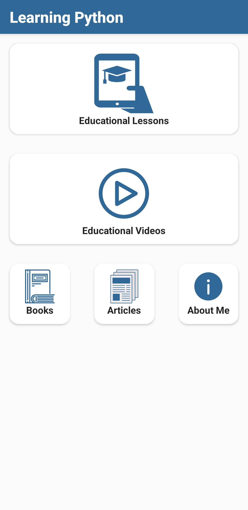

## Overview
A simple Android application designed to help beginners learn the basics of the Python programming language through structured lessons and videos.

---

## Features

- Main screen includes:
  - Lessons
  - Educational videos
  - Books / Articles sections
  - About Us page
- Clean UI design using:
  - **LinearLayout**, **ConstraintLayout**, **RelativeLayout**
  - **CardView**
- Navigation between screens using **Intents**
- At least 5 main screens

---

## Technologies Used

- **Programming Language:** Java
- **IDE:** Android Studio
- **Gradle**

---

## Project Structure

- `MainActivity`: Main screen
- `LoginActivity`: Login screen
- `LessonsActivity`: Lessons list
- `VideosActivity`: Videos list
- `BooksActivity` / `ArticlesActivity`: Extra sections
- `AboutActivity`: About me
---

---

## How to Run

1. Download or clone this repository.
2. Open the project in Android Studio.
3. Run it on an Emulator or a physical Android device.

---

### Notes
This project is for educational purposes to practice Android development basics using Java.

---

### Screenshots

# Login Screen

# Main Screen

# Lessons Screen

# Videos Screen

# About Me Screen

